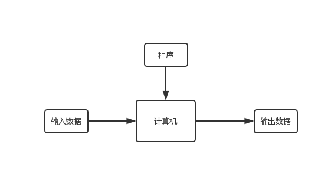
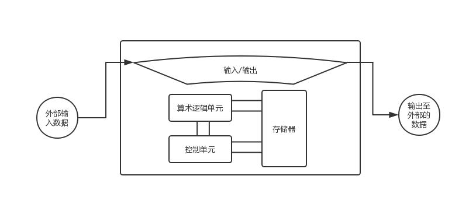

# 第一章 绪论

本章主要讨论如下内容：

+ 计算机模型（图灵，冯诺依曼）
+ 计算机发展史
+ 计算机出现后所增加的社会和道德问题
+ 计算机科学领域总览

## 图灵模型

阿兰・图灵在1937年提出了一个通用计算设备的设想，也就是现在所说的***图灵机***。

### 原始的数据处理器模型

在这个模型的定义下，计算机仅根据外部输入得到输出。

也就是简单的输入->计算机->输出的模型。

但这个定义过于宽泛，其仅仅是描述一类数据处理设备的工作方式，并不能特定规定计算机。

而且其并没有区分其为专用计算模型还是通用计算模型，而显然计算机输入通用计算模型。

### 可编程数据处理器模型

可编程的数据处理器模型则是在上述的数据模型之中加入了**程序**这一额外输入。

改造后的数据处理器模型的工作方式则是输入数据+程序->计算机->输出，这也就是**图灵模型**。

在图灵模型中，计算机根据程序来将输入数据处理成输出数据，这样也就做到了其通用性。

## 冯・诺依曼模型

冯诺依曼模型相较于图灵模型最大的不同点在于，图灵模型只将数据存于计算机中，程序靠外部读取，而冯诺依曼模型将程序和数据都存在计算机中。

基于这个理念设计的冯诺依曼模型如下所示：

其主要包括四个部分：

+ 存储器：用于存储**数据**和**程序**的区域
+ 算术逻辑单元：用于进行计算的单元（包括算术运算和逻辑运算）
+ 控制单元：控制存储器，算术逻辑单元，输入/输出等子系统的单元
+ 输入/输出：包括接收输入的设备，传出输出结果的设备，输入输出缓存区等一系列与输入/输出有关的系统

### 冯诺依曼模型中的程序

在冯诺依曼模型中，程序被看作是一条条指令的集合体。

控制器按顺序从存储器中读入指令，解析指令，执行指令。

## 计算机组成部分

计算机由计算机硬件，数据，计算机软件组成。

## 计算机发展史

+ 机械计算机器（1930年以前）

  这个阶段下出现了许多用于计算的机器，但还没有提出计算机这个概念（简单的讲就是图灵发话以前）。

+ 电子计算机的诞生（1930～1950）

  这个时候开始出现计算机的雏形。早期的电子计算机都是基于图灵模型，换句话说，这个阶段的计算机的程序靠外部输入（打孔卡，人工接线等）。

+ 计算机的诞生（1950～）

  这个阶段开始的计算机基本都是基于冯诺依曼模型的计算机。

  + 第一代计算机（1950～1959）

    这个阶段的计算机体积庞大，且使用真空管作为电子开关。

  + 第二代计算机（1959～1965）

    计算机开始缩小体积，并使用晶体管代替真空管。这个阶段开始出现高级计算机语言。

  + 第三代计算机（1965～1975）

    集成电路替代了晶体管，开始出现小型计算机。与此同时软件包开始出现，人们只需要买过来就能用，而不需要自己写程序。

  + 第四代计算机（1975～1985）

    此时的科技以允许将整个计算机的子系统做在单块电路板上。这个阶段出现了微型计算机和计算机网络。

  + 第五代计算机（1985～）

    这个阶段出现了我们现在所用的掌上计算机和台式计算机。

## 社会和道德问题

社会问题主要有：

+ 依赖：部分人们认为计算机的便利会让人类产生依赖，一旦离开计算机人类的生活就会很困难。
+ 社会公正：部分人们认为只有高端人群才能用得起计算机，这对低端人群不公正。
+ 数字化分裂：基于上一条，用计算机的人群会跟不用计算机的人群产生分裂。

道德问题主要有：

+ 隐私：计算机网络带来的通信和数据隐私问题。
+ 版权：数据版权和电子版权等。
+ 计算机犯罪：黑客之类的。

## 计算机科学领域

计算机科学简单地讲包括两个领域：系统领域和应用领域。

系统领域主要指跟计算机软硬件直接相关的领域，如计算机体系结构，操作系统，计算机网络，算法，程序设计语言，软件工程等。

应用领域主要指与计算机的**使用**有关的领域，如数据库，人工智能等。

# 第一章复习题

#### 1. 定义一个基于图灵模型的计算机

基于图灵模型的计算机从外部获取输入和程序，通过机器执行程序计算得到输出。

#### 2. 定义一个基于冯诺依曼模型的计算机

基于冯诺依曼模型的计算机包括存储器，算术逻辑单元，控制单元和输入/输出四部分。程序存于存储器中。计算机接收外部输入并通过控制单元执行存储器的程序得到输出。

#### 3. 在基于图灵模型的计算机中，程序的作用是什么

程序是一系列的指令，计算机通过程序告诉机器如何处理输入得到输出。

#### 4. 在基于冯诺依曼模型的计算机中，程序的作用是什么

额，等等，这跟上一题的区别在哪。。

冯诺依曼模型中程序的作用也是告诉机器处理输入得到输出啊。。

不同点只是在程序的获得方式和处理方式而已。在冯诺依曼模型中程序是直接存储在存储器中，执行的时候也是由控制器按顺序从存储器中一条一条获取指令并执行。

#### 5. 计算机中有哪些子系统

看了一眼下面四道题之后发现这题出的十分老实。。

嘛。。毕竟是复习题。

目前的计算机都是基于冯诺依曼模型设计的，故其包括存储器，算术逻辑单元，控制单元，输入/输出这四个子系统。

#### 6. 计算机中存储器子系统的功能是什么

存储器用于存储程序和数据。

#### 7. 计算机中ALU子系统的功能是什么

ALU用于进行算术运算和逻辑运算。

#### 8. 计算机中控制单元子系统的功能是什么

控制单元用于控制其他子系统。

#### 9. 计算机中输入/输出子系统的功能是什么

输入/输入用于接收外部输入，将输出传出外部，以及其他跟输入输出相关的功能。

#### 10. 简述5个时代的计算机

+ 第一代计算机：体积大，用真空管做电子开关
+ 第二代计算机：体积缩小，用晶体管取代真空管
+ 第三代计算机：体积再缩小，用集成电路取代晶体管
+ 第四代计算机：微型计算机
+ 第五代计算机：掌上计算机和台式计算机

# 第一章练习题

#### 1. 解释为什么计算机不能解决那些计算机外部世界无解决方法的问题

首先，计算机的功能简单的讲就是根据程序将输入转变为输出。那么这里的程序事实上就是将输入转变为输出的解决方法。而根据计算机的定义，程序并不能由计算机自发产生，而是要外部输入（图灵模型）或者是外部将程序存入存储器中（冯诺依曼模型）。故如果外部世界无解决方法，则意味着也无法给出用于计算机执行解决问题的程序，故计算机不能解决外部世界无解决方法的问题。

#### 2. 如果一台小的便宜的计算机可以做大型昂贵的计算机同样能做的事情，为什么人们需要大的

显然，在同等的技术力的情况下，更大更昂贵的计算机也就意味着其运算速度会更快。人们为了能更快解决问题或者需要更高的计算性能的情况下，就会选择更大的电脑。

当然，也满足人们的装逼心理（x

#### 3. 研究Pascaline计算器，看看它是否符合图灵模型

Pascaline是一种17世纪的加法器，其作用是通过旋转齿轮来达到计算加减法的目的。显然这是一个专用的计算器，并不符合图灵模型。

#### 4. 研究莱布尼茨之轮，看看它是否符合图灵模型

莱布尼茨之轮说白了就是一个乘法器，可以看作是Pascaline的威力加强版（可以算乘除法，据说还能开平方）。但其仍旧逃不过专用计算器的范畴，故其仍然不符合图灵模型。

#### 5. 研究雅卡尔提花织机，看看它是否符合图灵模型

雅卡尔提花织机第一次运用了存储和编程的概念，其通过打孔卡来控制织布的过程。虽然看起来的确是符合了输入+程序->计算机->输出这一套，但由于其并不通用（过于特化），故其仍然不是符合图灵模型的机器。

#### 6. 研究查尔斯・巴比奇分析引擎，看看它是否符合冯诺依曼模型

查尔斯・巴比奇分析引擎是一个用于进行数学计算的机器，其与冯诺依曼模型的结构是一样的，包含了制造场（算术逻辑单元），存储单元（存储器），操作者（控制单元）和输出单元（输入/输出）。但是由于其程序仍旧需要借助外部人员输入，以及其不具备通用性（仅限算术运算），故其不符合冯诺依曼模型。

#### 7. 研究ABC计算机，看看它是否符合冯诺依曼模型

ABC计算机用于求解线性方程组，并且其不可编程，而且其中间结果的存储机制是不可靠的。其缺乏通用性，可变性，存储程序的机制，故其仍然不符合冯诺依曼模型。

#### 8. 研究并找出键盘起源于哪一代计算机

键盘的起源其实比计算机更早，其起源于打字机的时代。那会还没有计算机，而打字机上已经有键盘了。键盘真正用于计算机上是在第二代计算机末第三代计算机初的时候。

