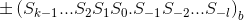
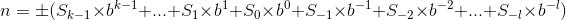
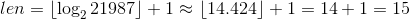

# 第二章 数字系统

本章主要讨论如下内容：

+ 数字系统的定义
+ 位置化数字系统
+ 非位置化数字系统

## 什么是数字系统

通俗的讲就是表示数字的符号形式规则。也就是定义一套符号规则来唯一的表达唯一的一个数字。我们常用的十进制就是一个数字系统。

数字系统主要分为位置化数字系统和非位置化数字系统。前者更加常用。

## 位置化数字系统

在位置化数字系统中，数字中符号所占据的位置决定了其表示的值。

位置系统表示一个数字的基本形式为：



其值为：



其中：

+ S是一套符号系统，每个符号表示一个数值。数值从1开始并且是差为1的等差。
+ b是底（或称为基数），其表示S中的符号个数。

这么讲比较难理解（有点抽象），其实只要结合下面的例子就好理解了。

### 十进制系统

十进制系统中，基数为十，符号集S包括0到9这十个符号。

这是我们最常用的数字系统，故我们一般会省略底数表示。

这个就不用多讲吧。。。

### 二进制/八进制/十六进制系统

其实就是把底数换成2或8或16而已。

如果采用这种表示方式的话，为了跟十进制表示方式区分开，故需要将底数标出来。

特别说明的是，在十六进制系统中，符号集S包括了数字0到9和字母A到F，字母A到F分别表示十进制的10到15。

### 进制间转换

一般而言，将A进制的数字转换为B进制的数字分为两部：

+ 将A进制的数字转换为十进制
+ 将十进制的数字转换为B进制

#### 将其他进制转换为十进制

这个时候只需要用上前面提到的求值公式即可：


记得先将符号转换为十进制数字，例如说在十六进制转十进制的时候就需要把字母A换成数字10。

#### 将十进制转换为其他进制

先是将十进制数的整数部分和小数部分分开，两个部分分别计算。

##### 整数部分

整数部分利用类似连续除法的方法计算：

1. 创建一个空的字符串，这个字符串就是转换后的结果。
2. 将原本的十进制数字除以其他进制的底数，得到余数和商。
3. 将余数按照其他进制的字符集转换为对应的字符，从头部push进去（例如说将`6`从头部push进`A5`就会变成`6A5`）。
4. 如果商为0，那么完成转换，字符串即为最终结果。否则用商替换掉原本的十进制数，并回到步骤2。

##### 小数部分

弄懂了整数部分的转换方法之后，小数部分也就是类似了：

1. 创建一个空的字符串，这个字符串就是转换后的结果。

2. 将原本的十进制数字**乘以**其他进制的底数，得到结果。

   + 注意这里的十进制数字永远都是小于1的小数。

3. 将结果的整数部分提取出来，留下小数部分。

   + 整数部分记为A，如果没有整数部分那么A=0。

   + 此时这个十进制只剩小数部分，于是又会变为小于1的小数。

4. 将A按照其他进制的字符集转换为对应的字符，从**尾部**push进去（例如说将`6`从尾部push进`A5`就会变成`A56`）。

5. 如果此时十进制数为0，那么完成转换，字符串即为最终结果。否则回到步骤2。

##### 整合

最后只需要将整数部分和小数部分拼起来即可，记得中间加小数点。

#### 成幂次关系的进制间转换

所谓的成幂次关系可以理解为，假设A进制和B进制满足A的m次方等于B，那么他们就满足幂次关系。

这个时候他们之间的转换就有了更加简单的方式：**一一对应**

以二进制和十六进制为例。注意这里一直都要以**四**为单位的原因是2的4次方等于16。

要将二进制转换为十六进制只需要将二进制数字每四个数位转换为一个十六进制数位即可，位置不变。

例如说二进制数字`101110101010111`转换为十六进制

首先先按从低到高每四个为一组切分，就会变成`101 1101 0101 0111`。

接着只需要一个一个转就行了：

+ `101->5`
+ `1101->13->D`
+ `0101->5`
+ `0111->7`

于是其十六进制结果便是`5D57`。

从十六进制转回二进制也是一一对应的，只需要将十六进制的数位一个个转换为二进制数字（注意不足四位要补零）再拼起来就行了。

#### 求数字的长度

一个简单的问题是，将某个十进制数字转换成二进制数字，它的长度会有多长。

对于这个问题，我们可以不需要将这个数字转换出来才知道它的长度，而是可以通过求对数的方式来求。

举个例子，十进制数字`21987`的二进制长度就等于其以2为底的对数向下取整再加一，也就是：



> 这里在原书中的求法是以2为底的对数向上取整。但这个方法在遇到2的幂的时候就会发生错误。
>
> 举个例子，8在以2为底的对数是3（因为2的3次幂是8），但8转换为二进制是1000，有四位，故其是错的。
>
> 故将其修正为我上面说的方法。

## 非位置化数字系统

非位置化数字系统也会有自己的符号集，但其位置跟数位的大小并无关系。

典型的非位置化数字系统为**罗马数字系统**。


# 第二章复习题

#### 1. 定义一个数字系统

数字系统就是用一套符号唯一地表示数字的系统。

#### 2. 辨析位置化和非位置化数字系统

位置化数字系统中，一个符号在某个位置唯一地决定了它所代表的值。而在非位置化数字系统中，符号的位置与其所表示的数值无关。

#### 3. 定义位置化数字系统中的底或基数。位置化数字系统中，底与符号的数量有什么关系？

额。。底或基数的定义就能够回答后面这个问题了好伐。。

位置化数字系统中的底或基数就是这个系统中所用的符号的数量。

#### 4. 简述十进制系统。为什么称作十进制？该系统的底是多少？

十进制系统是一个位置化数字系统，其底为10，符号集S为`{0, 1, 2, 3, 4, 5, 6, 7, 8, 9}`。

该位置化系统的数字逢十进一，故称为十进制。

另，这四道题都好蛋疼。。

查了一下其实是翻译的锅。。这四个问题的第二小问其实想问的是十进制/二进制之类的单词的词源，例如说十进制（decimal）的词源就是拉丁词根的十（decem）。但这里直接翻译过来就很莫名起源了。

果然换个语言连题意都变了。。

#### 5. 简述二进制系统。为什么称作二进制？该系统的底是多少？

二进制系统是一个位置化数字系统，其底为2，符号集S为`{0, 1}`。

该位置化系统的数字逢二进一，故称为二进制。

#### 6. 简述八进制系统。为什么称作八进制？该系统的底是多少？

八进制系统是一个位置化数字系统，其底为8，符号集S为`{0, 1, 2, 3, 4, 5, 6, 7}`。

该位置化系统的数字逢八进一，故称为八进制。

#### 7. 简述十六进制系统。为什么称作十六进制？该系统的底是多少？

十六进制系统是一个位置化数字系统，其底为16，符号集S为`{0, 1, 2, 3, 4, 5, 6, 7, 8, 9, A, B, C, D, E, F}`。

该位置化系统的数字逢十六进一，故称为十六进制。

#### 8. 为什么二进制和十六进制互换很容易？

因为二进制和十六进制之间的互换不需要十进制作为中间转换产物，二进制中每四位就对应了十六进制中的一位。转换的时候只需要直接对应转换即可。

#### 9. 十六进制系统中的1个数码表示二进制系统中的几位？

十六进制系统中的1个数码表示二进制系统中的4位。

#### 10. 八进制系统中的1个数码表示二进制系统中的几位？

八进制系统中的1个数码表示二进制系统中的3位。


# 第二章练习题

题目太多太长我就不抄了，直接放答案好了。

#### 第1题

a：`01101 -> 8+4+1 -> 13`

b：`1011000 -> 64+16+8 -> 88`

c：`011110.01 -> 16+8+4+2+0.25 -> 30.25`

d：`111111.111 -> 32+16+8+4+2+1+0.5+0.25+0.125 -> 63.875`

#### 第2题

a：`AB2 -> 10*16*16+11*16+2 -> 2560+176+2 -> 2738`

b：`123 -> 1*16*16+2*16+3 -> 256+32+3 -> 291`

c：`ABB -> 10*16*16+11*16+11 -> 2560+176+11 -> 2747`

d：`35E.E1 -> 3*16*16+5*16+14+14/16+1/(16*16) -> 768+80+14+0.875+0.00390625 -> 862.87890625`

#### 第3题

a：`237 -> 2*8*8+3*8+7 -> 128+24+7 -> 159`

b：`2731 -> 2*8*8*8+7*8*8+3*8+1 -> 1024+448+24+1 -> 1497`

c：`617.7 -> 6*8*8+1*8+7+7/8 -> 384+8+7+0.875 -> 399.875`

d：`21.11 -> 2*8+1+1/8+1/(8*8) -> 16+1+0.125+0.015625 -> 17.140625`

#### 第4题

a：

```
1234/2=617...0
617/2=308...1
308/2=154...0
154/2=77...0
77/2=38...1
38/2=19...0
19/2=9...1
9/2=4...1
4/2=2...0
2/2=1...0
1/2=0...1

ans = 10011010010
```

b：

```
88/2=44...0
44/2=22...0
22/2=11...0
11/2=5...1
5/2=2...1
2/2=1...0
1/2=0...1

ans = 1011000
```

c：

```
124/2=62...0
62/2=31...0
31/2=15...1
15/2=7...1
7/2=3...1
3/2=1...1
1/2=0...1

0.02*2=0.04 -> 0
0.04*2=0.08 -> 0
0.08*2=0.16 -> 0
0.16*2=0.32 -> 0
0.32*2=0.64 -> 0
0.64*2=1.28 -> 1
0.28*2=0.56 -> 0
0.56*2=1.12 -> 1
0.12*2=0.24 -> 0
0.24*2=0.48 -> 0
...

ans=1111100.0000010100...
```

d：

```
14/2=7...0
7/2=3...1
3/2=1...1
1/2=0...1

0.56*2=1.12 -> 1
0.12*2=0.24 -> 0
0.24*2=0.48 -> 0
0.48*2=0.96 -> 0
0.96*2=1.92 -> 1
0.92*2=1.84 -> 1
0.84*2=1.68 -> 1
0.68*2=1.36 -> 1
0.36*2=0.72 -> 0
0.72*2=1.44 -> 1

ans=1110.1000111101...
```

#### 第5题

a：

```
1156/8=144...4
144/8=18...0
18/8=2...2
2/8=0...2

ans=2204
```

b：

```
99/8=12...3
12/8=1...4
1/8=0...1

ans=143
```

c：

```
11/8=1...3
1/8=0...1

0.4*8=3.2 -> 3
0.2*8=1.6 -> 1
0.6*8=4.8 -> 4
0.8*8=6.4 -> 6
...

ans=13.31463146...
```

d：

```
72/8=9...0
9/8=1...1
1/8=0...1

0.8*8=6.4 -> 6
0.4*8=3.2 -> 3
0.2*8=1.6 -> 1
0.6*8=4.8 -> 4
...

ans=110.63146314...
```

#### 第6题

a：

```
567/16=35...7
35/16=2...3
2/16=0...2

ans=237
```

b：

```
1411/16=88...3
88/16=5...8
5/16=0...5

ans=583
```

c：

```
12/16=0...12(C)

0.13*16=2.08 -> 2
0.08*16=1.28 -> 1
0.28*16=4.48 -> 4
0.48*16=7.68 -> 7
0.68*16=10.88 -> 10(A)
0.88*16=14.08 -> 14(E)
...

ans=C.2147AE..
```

d：

```
16/16=1...0
1/16=0...1

0.5*16=8.0 -> 8

ans=10.8
```

#### 第7题

a：

```
5 -> 101
1 -> 001
4 -> 100
(514)_8 -> (101001100)_2

0001 -> 1
0100 -> 4
1100 -> C

ans=14C
```

b：

```
4 -> 100
1 -> 001
1 -> 001
(411)_8 -> (100001001)_2

0001 -> 1
0000 -> 0
1001 -> 9

ans=109
```

c：

```
1 -> 001
3 -> 011
7 -> 111
(13.7)_8 -> (1011.111)_2

1011 -> B
1110 -> E

ans=B.E
```

d：

```
1 -> 001
2 -> 010
5 -> 101
6 -> 110
(1256)_8 -> (1010101110)_2

0010 -> 2
1010 -> A
1110 -> E

ans=2AE
```

#### 第8题

a：

```
5 -> 0101
1 -> 0001
A -> 1010
(51A)_16 -> (10100011010)_2

010 -> 2
100 -> 4
011 -> 3
010 -> 2

ans=2432
```

b：

```
4 -> 0100
E -> 1110
1 -> 0001
(4E1)_16 -> (10011100001)_2

010 -> 2
011 -> 3
100 -> 4
001 -> 1

ans=2341
```

c：

```
B -> 1011
B -> 1011
C -> 1100
(BB.C)_16 -> (10111011.1100)_2

010 -> 2
111 -> 7
011 -> 3
110 -> 6

ans=273.6
```

d：

```
A -> 1010
B -> 1011
C -> 1100
D -> 1101
(ABC.D)_16 -> (101 010 111 100.1101)_2

101 -> 5
010 -> 2
111 -> 7
100 -> 4
110 -> 6
100 -> 4

ans=5274.64
```

#### 第9题

a：`01101 -> 15`

b：`1011000 -> 130`

c：`011110.01 -> 36.2`

d：`111111.111 -> 77.7`

#### 第10题

a：`01101 -> D`

b：`1011000 -> 58`

c：`011110.01 -> 1E.4`

d：`111111.111 -> 3F.E`

#### 第11题

a：`121=64+32+16+8+1=(1111001)_2`

b：`78=64+8+4+2=(1001110)_2`

c：`255=128+64+32+16+8+4+2+1=(11111111)_2`

d：`214=128+64+16+4+2=(11010110)_2`

#### 第12题

a：`3+(5/8)=2+1+(1/2)+(1/8)=(11.101)_2`

b：`12+(3/32)=8+4+(1/16)+(1/32)=(1100.00011)_2`

c：`4+(13/64)=4+(1/8)+(1/16)+(1/64)=(100.001101)_2`

d：`12+(5/128)=8+4+(1/32)+(1/128)=(1100.0000101)_2`

#### 第13题

a：`(111111)_2=63`

b：`999999`

c：`(FFFFFF)_16=16777215`

d：`(777777)_8=262143`

#### 第14题

a：`log_2(10000)=13.28 -> 14`

b：`log_8(1000)=3.32 -> 4`

c：`log_16(1000000)=4.98 -> 5`

#### 第15题

a：`log_10(2^4)=1.2 -> 2`

b：`log_10(8^2)=1.8 -> 2`

c：`log_10(16^2)=2.4 -> 3`

#### 第16题

a：

```
0.1875*2=0.375 -> 0
0.375*2=0.75 -> 0
0.75*2=1.5 -> 1
0.5*2=1 -> 1
ans=(0.0011)_2=(1/8)+(1/16)
```

b：

```
0.640625*2=1.28125 -> 1
0.28125*2=0.5625 -> 0
0.5625*2=1.125 -> 1
0.125*2=0.25 -> 0
0.25*2=0.5 -> 0
0.5*2=1 -> 1
ans=(0.101001)_2=(1/2)+(1/8)+(1/64)
```

c：

```
0.40625*2=0.8125 -> 0
0.8125*2=1.625 -> 1
0.625*2=1.25 -> 1
0.25*2=0.5 -> 0
0.5*2=1
ans=(0.01101)_2=(1/4)+(1/8)+(1/32)
```

d：

```
0.375*2=0.75 -> 0
0.75*2=1.5 -> 1
0.5*2=1 -> 1
ans=(0.011)_2=(1/4)+(1/8)
```

#### 第17题

a：`7.1875 -> 111.0011`

b：`12.640625 -> 1100.101001`

c：`11.40625 -> 1011.01101`

d：`0.375 -> 0.011`

#### 第18题

a：`(10^11)-1=9999999999`

b：`(2^13)-1=8191`

c：`(8^9)-1=134217727`

d：`(16^8)-1=4294967295`

#### 第19题

a：`log_2(1000-1)=9.96 -> 10`

b：`log_2(100000-1)=16.61 -> 17`

c：`log_2(64-1)=5.98 -> 6`

d：`log_2(256-1)=7.99 -> 8`

#### 第20题

a：14

b：8

c：13

d：4

#### 第21题

a：`17*256*256*256+234*256*256+34*256+14=300556814`

b：`14*256*256*256+56*256*256+234*256+56=238611000`

c：`110*256*256*256+14*256*256+56*256+78=1846425678`

d：`24*256*256*256+56*256*256+13*256+11=406326539`

#### 第22题

a：`00010001 11101010 00100010 00001110`

b：`00001110 00111000 11101010 00111000`

c：`01101110 00001110 00111000 01001110`

d：`00011000 00111000 00001101 00001011`

#### 第23题

a：15

b：27

c：48

d：1157

#### 第24题

a：XVII

b：XXXVIII

c：LXXXII

d：IM

#### 第25题

cd是错的。V不能放在大数的左边。

#### 第26题

+ `12`就是上面两个点加下面两横
+ `123=6*20+3`，也就是其上面是6（一点+一横），下面是3（三点）
+ `452=1*20*20+2*20+12`，也就是其最上方是1（一点），中间是2（两点），下面是12（两点+两横）
+ `1256=3*20*20+2*20+16`，也就是其最上方是3（三点），中间是2（两点），下面是16（一点+三横）

#### 第27题

> MarkDown就算再强大也写不了巴比伦数字啊orz

##### Problem a

+ `11291=3*60*60+8*60+11`，故其第一位是3，第二位是8，第三位是11。（我就不去画巴比伦数字了，下同）
+ `3646=1*60*60+0*60+46`，故其第一位是1，第二位是0，第三位是46。
+ `3582=59*60+42`，故其第一位是59，第二位是42。

#####  Problem b

没有0会出现的问题显然就是使整套数字系统不完善，例如说其无法表示0，60，120等60的倍数，以及3601这种转换之后中间会有某一位为空的情况。

巴比伦数字系统一开始的方法简单粗暴：直接叠符号。例如说50是由5个`<`表示的，那么60就用6个`<`表示。

后来巴比伦数字系统引入`.`来表示零。
